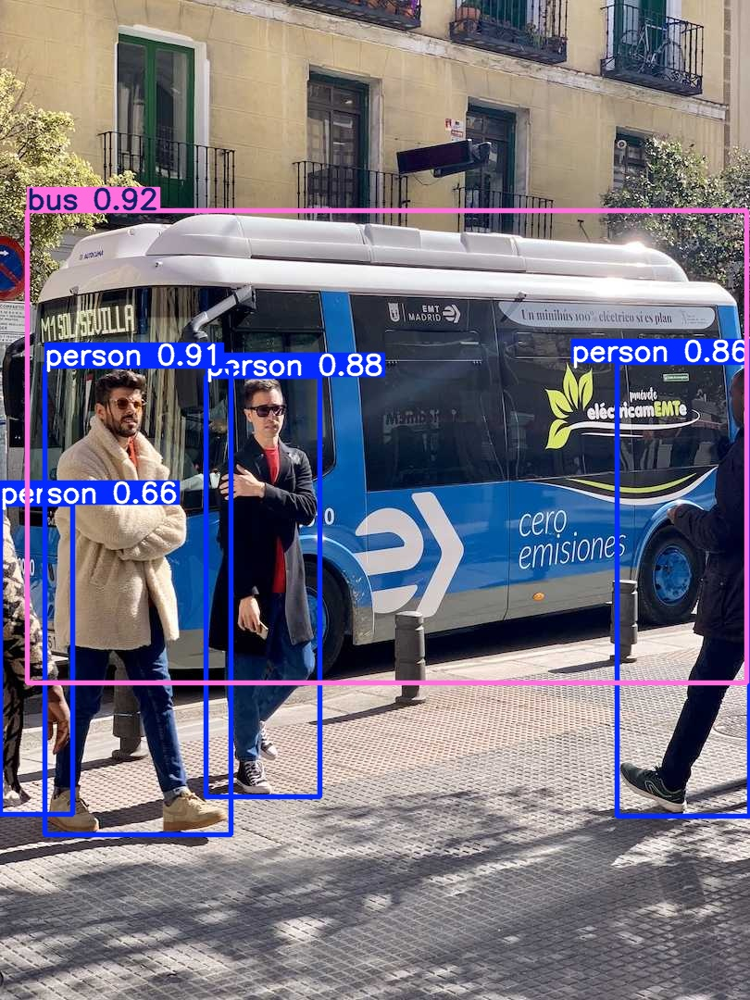
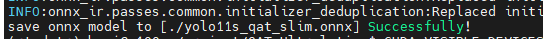

工程基于Ultralytics仓库用于做yolo系列的QAT训练；

|model|map@50-95|map@50|
|--|--|--|
|yolov11s.pt|0.466|0.635|
|yolov11s_8w8f_qdq.onnx|0.456|0.628|

## 环境安装
基于官方工程，安装ultralytics库。yolo11n或自定义的轻量级模型 安装环境，参考[nano模型环境安装](./README_nano.md)。

```
pip install -r requirements.txt
```

安装额外库

```
pip install e . # ultralytics
```

我们发现 `onnxruntime` 和 `onnxscript` 的其他版本可能引起精度误差和导出错误，因此**pytorch\==2.6; onnxruntime\==1.21.0 onnxscript\==0.4.0** 是必须的。

## 数据集路径修改

修改 ./ultralytics/cfg/datasets/coco.yaml 中的数据集路径;

## QAT训练
```
python train.py
```

## onnx eval
```
python eval.py
```
eval精度如下：

```
Average Precision  (AP) @[ IoU=0.50:0.95 | area=   all | maxDets=100 ] = 0.456
Average Precision  (AP) @[ IoU=0.50      | area=   all | maxDets=100 ] = 0.628
Average Precision  (AP) @[ IoU=0.75      | area=   all | maxDets=100 ] = 0.495
Average Precision  (AP) @[ IoU=0.50:0.95 | area= small | maxDets=100 ] = 0.286
Average Precision  (AP) @[ IoU=0.50:0.95 | area=medium | maxDets=100 ] = 0.498
Average Precision  (AP) @[ IoU=0.50:0.95 | area= large | maxDets=100 ] = 0.633
Average Recall     (AR) @[ IoU=0.50:0.95 | area=   all | maxDets=  1 ] = 0.354
Average Recall     (AR) @[ IoU=0.50:0.95 | area=   all | maxDets= 10 ] = 0.591
Average Recall     (AR) @[ IoU=0.50:0.95 | area=   all | maxDets=100 ] = 0.645
Average Recall     (AR) @[ IoU=0.50:0.95 | area= small | maxDets=100 ] = 0.463
Average Recall     (AR) @[ IoU=0.50:0.95 | area=medium | maxDets=100 ] = 0.698
Average Recall     (AR) @[ IoU=0.50:0.95 | area= large | maxDets=100 ] = 0.810
```

## onnx test
```
python test.py
```
test会加载根目录下的bus.jpg文件进行推理，然后输出推理结果



## onnx转AXModel

#### 1、模型

使用`yolo11s_qat_slim.onnx`




#### 2、配置文件
``` json
{
  "model_type": "QuantONNX",
  "npu_mode": "NPU1",
  "quant": {
    "input_configs": [
      {
        "tensor_name": "DEFAULT",
        "calibration_dataset": "s3://npu-ci/data/data.zip"
      }
    ],
    "calibration_method": "MinMax",
    "layer_configs":  [
      {
        "op_types": ["MatMul"],
        "data_type": "S16",
      },
      {
        "layer_names": ["node_Reshape_740", "node_Split_1800", "node_Transpose_765", "node_Transpose_791"],
        "data_type": "S16",
      },
    ],
  },
  "compiler": {
    "check": 2
  }
}

```
**原因**：QAT时为保证`MatMul`算子精度，避免上溢出等问题，未对`MatMul`做更细粒度的量化，而`MatMul`前的`shape`变换算子，被统一纳入子图做QAT，它们在训练时的量化精度相同，所以在转换时需要与`MatMul`算子置为相同的量化数据类型。
其中`layer_names`中的节点为`MatMul`节点前的`reshape`,`split`,`transpose`等算子。

##### 2.1 使用Netron打开`yolo11s_qat_slim.onnx`进行查找，搜索`MatMul`


第二处：


##### 2.2 将相关节点放入`layer_names`中，并置为`S16`数据类型。

#### 3、转换

``` shell
pulsar2 build --input ./weights/yolo11s_qat_slim.onnx --config ./config.json --output_dir ./output
```
