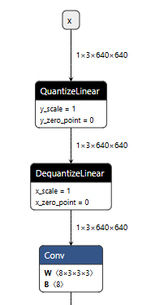

# nano模型的训练环境安装
前提：卷积核参数量小于512
方法：使用官方代码导出`onnx`模型查看最小卷积核大小，确定`input_size_limit`大小进行对应配置。如下图中为 8x3x3x3=216小于512，需配置`input_size_limit=192`或更小数值。


## 环境安装
### 1.1 安装基础环境
```
pip install -r requirements-nano.txt
pip install -e .
```
### 1.2 安装onnxscript
onnscript 需从调整源码，从源码安装。
#### 1.2.1 下载0.4.0的源码
``` 
https://github.com/microsoft/onnxscript/archive/refs/tags/v0.4.0.zip
https://github.com/microsoft/onnxscript/archive/refs/tags/v0.4.0.tar.gz
```
#### 1.2.1 调整源码
解压文件并进入文件目录。
```
cd onnxscript/optimizer
```
修改`_optimizer.py`中`input_size_limit`为0。如果自定义yolo结构，不使用C2PSA模块，可根据实际导出图中算子最小卷积核大小设置`input_size_limit`。


原因：PSA模块含Attention，其中有Mul算子，如果不设置为0量化信息会被折叠，导致后续量化报错。


#### 1.2.3 安装
``` shell
# onnxscript目录下
pip install -r requirements-dev.txt
pip install -e .
```
### 1.3 确定input_size_limit大小
原因：在导出代码，使用了`onnx_program.optimize()`进行图优化，内部调用 `onnxscript`，其内部设置了 `input_size_limit=512`，若节点的`weight shape`小于这个值，则会将节点进行常量折叠，导致`DequantizeLinear`节点丢失。
图结构正常：


图结构异常，卷积算子的`DequantizeLinear`被折叠:


