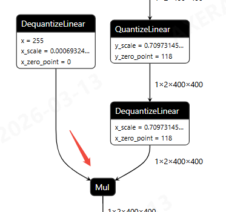
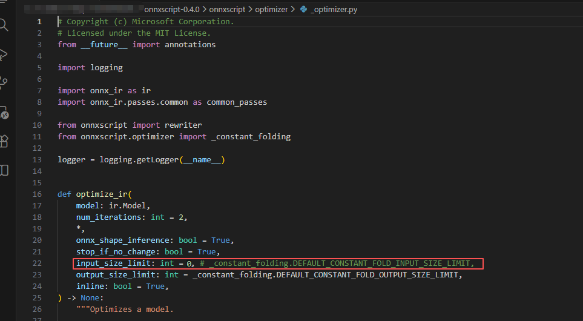
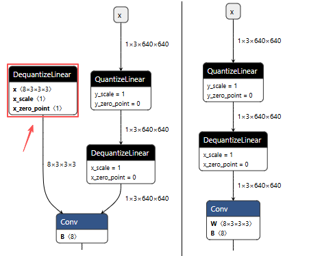
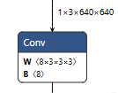

# nano模型的训练环境安装

### 1.1 安装基础环境
```
pip install -r requirements-nano.txt
pip install -e .
```
### 1.2 安装onnxscript

#### 1.2.1 背景

**原因：** 在导出代码，使用了 `onnx_program.optimize()` 进行图优化，内部调用 `onnxscript`，其内部设置了 `input_size_limit=512`，若节点的 `weight shape` 小于这个值，则会将节点进行常量折叠，导致含量化参数的 `DequantizeLinear` 节点丢失。

所以 `onnscript` 需调整源码，从源码安装。 

如 `C2PSA` 模块含 `Attention`，其中有 `Mul` 算子，如果不设置为`0`，左上角的 `DequantizeLinear` 会被折叠，导致后续量化报错。



#### 1.2.2 下载0.4.0的源码
``` 
https://github.com/microsoft/onnxscript/archive/refs/tags/v0.4.0.zip
或
https://github.com/microsoft/onnxscript/archive/refs/tags/v0.4.0.tar.gz
```
#### 1.2.3 调整源码
解压文件并进入文件目录。
```
cd onnxscript/optimizer
```
修改 `_optimizer.py` 中 `input_size_limit` 为 `0` 。如果自定义yolo结构，不使用 `C2PSA` 模块，可参考 [1.3.2 Conv2d算子示例](#section1.3.2) ，进行设置`input_size_limit`。



#### 1.2.4 安装
``` shell
# onnxscript目录下
pip install -r requirements-dev.txt
pip install -e .
```
### 1.3 其他

#### 1.3.1 官方修复
此问题在后续版本有修复，[[ONNX] Optimize should not fold DequantizeLinear](https://github.com/pytorch/pytorch/issues/177611)，但目前尚未测试新版本 `onnxscript`，所以仍采用这种方式安装。

<span id="section1.3.2"></span>
#### 1.3.2 Conv2d算子示例
正常图结构（左侧）与 异常图结构（右侧，卷积算子含量化参数的 `DequantizeLinear` 被折叠） ：



**方法：** 使用官方代码导出 `onnx` 模型查看最小卷积核大小，确定 `input_size_limit` 大小进行对应配置。如下图中为 `8x3x3x3=216` 小于 `512`，需配置 `input_size_limit=192` 或更小数值。

