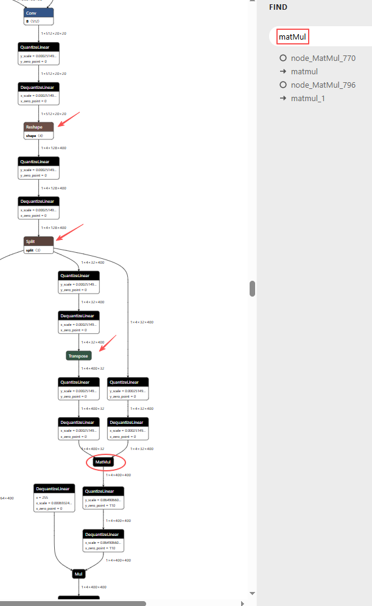
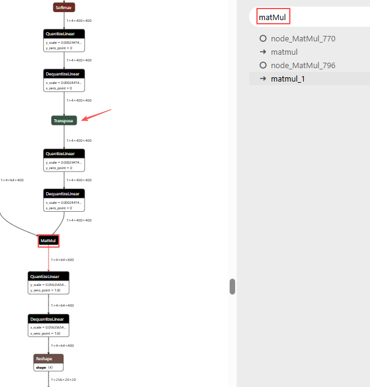

# QAT 部署转换指南


## 1. 导出
首先导出 qat_slim.onnx。
``` bash
python export.py
```

如果你的实验目录中生成的文件名不同，先确认实际输出路径，再继续后续步骤。


## 2. 使用 Netron 检查节点

建议用 Netron 打开导出的 `*_slim.onnx`，搜索 `MatMul`，并确认其前后节点。
节点1：

节点2：

重点关注：`Reshape`、`Split`、`Transpose`算子

这些节点被编译器归入同一子图，通常也需要加入 `layer_names` 并与 `MatMul` 保持相同的量化数据类型。

## 3. AXModel 转换配置

仓库中已有示例配置，仅供参考：

```bash
compile/config_s.json   yolo11s模型
compile/config_n.json   yolo11n模型
```

该配置核心逻辑是：

- `MatMul` 节点使用 `S16`
- `MatMul` 前的部分 `reshape`、`split`、`transpose` 节点也同步设置为 `S16`

原因：QAT 时为了保证 `MatMul` 精度、避免上溢出等问题，没有把 `MatMul` 压到更低精度。`MatMul` 前的部分 `shape` 变换算子与其处于同一量化子图，训练时量化精度保持一致，因此部署转换时也需要使用相同数据类型。


## 5. 转换命令

示例：

```bash
pulsar2 build --input runs/last_checkpoint_qat_slim.onnx --config ./compile/config_s.json --output_dir ./output
```

将`--input` 替换为真实路径。

## 6. 常见问题

### 6.1 `MatMul` 精度异常

优先检查：

- `MatMul` 是否已经被设置为 `S16`
- 前驱 shape 变换节点是否也被设置为 `S16`
- 导出的图里相关节点名是否变化

### 6.2 导出后量化图结构不对

优先检查：
- 是否按 [README_nano.md](../README_nano.md) 调整过 `input_size_limit`

### 6.3 配置文件路径找不到

仓库里的示例文件在：

```bash
compile/config_s.json
```

不是根目录的 `config.json`。
