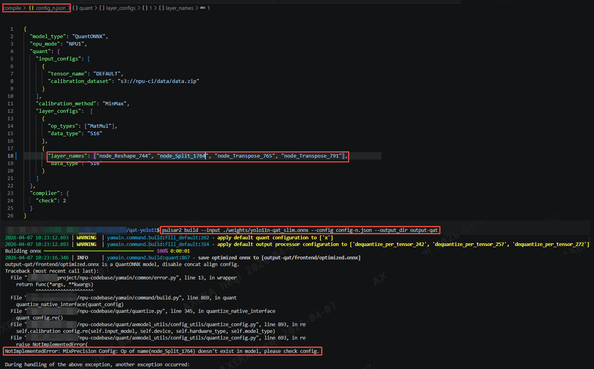
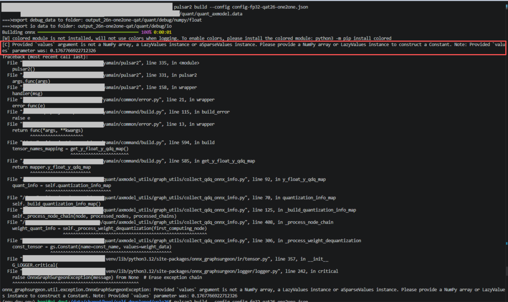
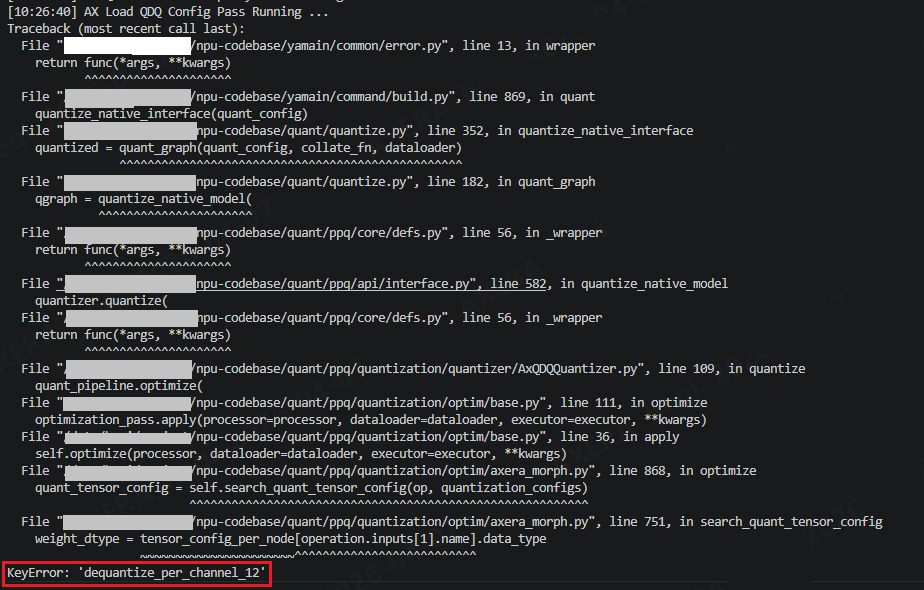

# QAT 部署转换指南

## 1. 导出
首先导出 `qat_slim.onnx`。
``` python
python export.py
```

如果你的实验目录中生成的文件名不同，先确认实际输出路径，再继续后续步骤。


<span id="section2"></span>
## 2. 量化配置

### 2.1 背景
QAT 时为了保证 `MatMul` 精度、避免上溢出等问题，把 `MatMul` 算子单独置为了 `S16`。`MatMul` 算子前的 `Shape` 变换算子被编译器归入同一子图进行 `QAT`，需要与 `MatMul` 保持相同的量化数据类型。

```
"layer_configs":  [
    {
        "op_types": ["MatMul"],
        "data_type": "S16"
    },
    {
        "layer_names": ["node_Reshape_744", "node_Split_1769", "node_Transpose_765", "node_Transpose_791"],
        "data_type": "S16"
    }
]
```

### 2.2 方法
用 `Netron` 打开导出的 `*_slim.onnx`，搜索 `MatMul`，确认该节点 **前** 的 `shape` 变换节点名，修改配置文件中的 `layer_names`。**重点关注：** `Reshape`、`Split`、`Transpose`算子。

节点1：


节点2：


<span id="section3"></span>
## 3. AXModel 转换配置

仓库中已有示例配置，仅供参考：

```bash
compile/config_s.json   yolo11s模型
compile/config_n.json   yolo11n模型
```

该配置核心逻辑是：

- `MatMul` 节点使用 `S16`
- `MatMul` 前的部分 `reshape`、`split`、`transpose` 节点也同步设置为 `S16`


## 4. 转换命令

示例：

```bash
pulsar2 build --input runs/qat_slim.onnx --config ./compile/config_s.json --output_dir ./output
```

将`--input` 替换为真实路径。

## 5. 测试

可使用 [qat-ax-infer.py](qat-ax-infer.py) 进行测试；使用 [test_acc.py](test_acc.py) 比对。

**注**：`qat-ax-infer` 里参考的是 `eval.py` 的流程，而不是 `test/predictor` 流程，性能和指标会略有差异。

## 6. 常见问题

### 6.1 模型转换时，节点找不到
若报错某节点找不到，则说明配置文件不适用于当前图，需要参考 [2. 使用 Netron 检查节点](#section2) 进行查找 `S16` 节点：



### 6.2 模型转换时，出现常量

若遇到此问题，请先升级工具链版本。原因是：`Mul` 算子其中一个输入为常值，在`onnxt`被处理为标量，而不是一维 `tensor` 或 `array`。




### 6.3 模型转换时，缺少 `dequantize` 节点

此问题应被最新的`onnxscript`依赖修复。若报错如下，则按照 [README_nano.md](../README_nano.md) 重新安装 `onnxscript`。


